# 数字积木ZYNQ核心板体验_软硬件协同处理
## 1. 开箱
  我非常荣幸能够测评由大佬数字积木制作的Xilinx Zynq7020 FPGA开发板。话不多说，直接开箱上图。<br>
  首先是测评的主角——Zynq7020开发板，板子的正反面如图1.1和图1.2所示（我是数字13）。毫不客气地说，板子非常的漂亮。

  <center>
    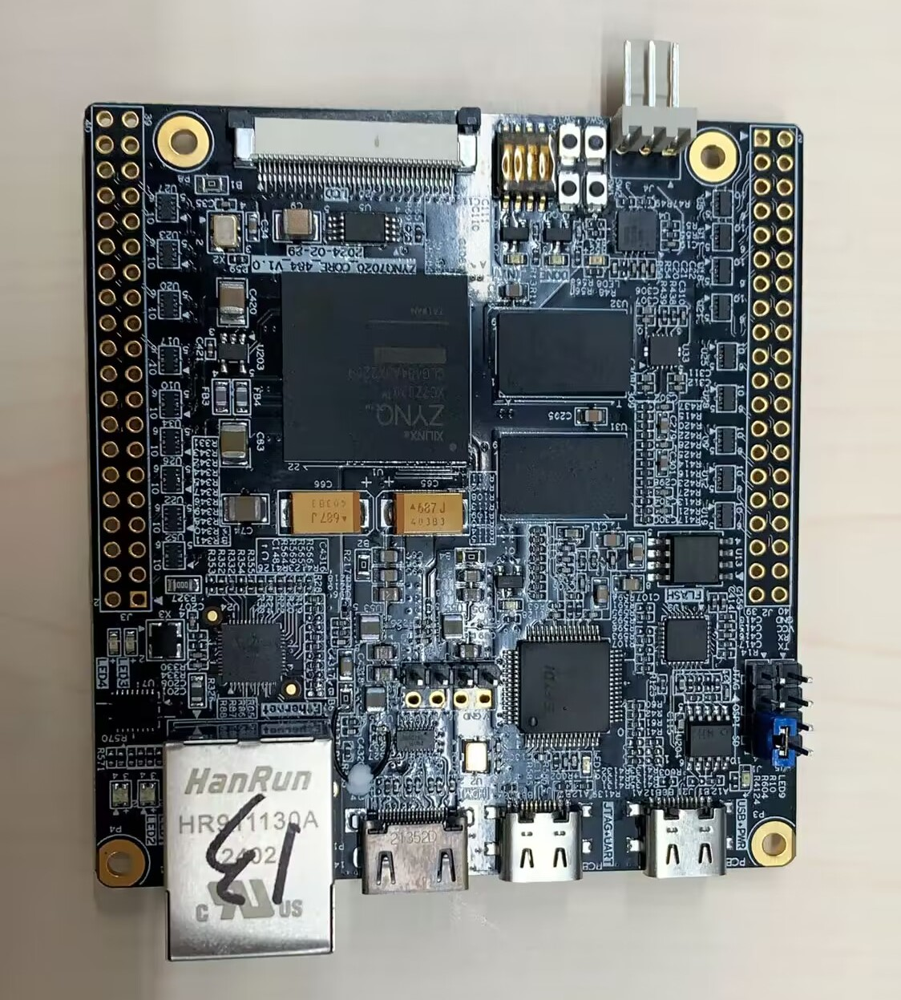
    <br>
    <div style="color:orange; border-bottom: 1px solid #d9d9d9;
    display: inline-block;
    color: #999;
    padding: 2px;">
      图1.1 开发板正面
  	</div>
</center>

  <center>
    
    <br>
    <div style="color:orange; border-bottom: 1px solid #d9d9d9;
    display: inline-block;
    color: #999;
    padding: 2px;">
      图1.2 开发板背面
  	</div>
</center>

  此外，博主还贴心的附上了一些器件，如图1.3所示。其为大家提供了一个被动式散热片、两个10x2的双列排针和一个10x1的单列排针，大家可以根据自己的需要灵活进行处理。在这里我使用了给台式机用的硅脂来连接散热器和FPGA芯片，但是效果并不是很好，硅脂具有一定的黏性使得散热器能够粘上去，但是并不牢靠。


  <center>
    
    <br>
    <div style="color:orange; border-bottom: 1px solid #d9d9d9;
    display: inline-block;
    color: #999;
    padding: 2px;">
      图1.3 附件图
  	</div>
</center>

最后，使用Type-C线连接该开发板以对其进行供电和串口通信，连接后的状态如图1.4所示。开发板处会亮起两个超级闪亮的LED灯，发出耀眼的绿色！

  <center>
    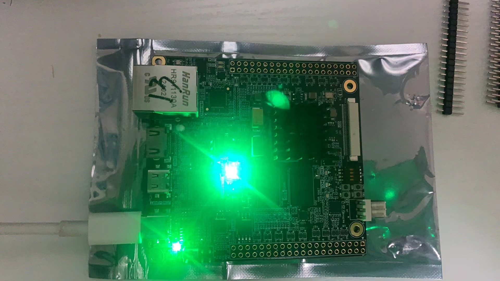
    <br>
    <div style="color:orange; border-bottom: 1px solid #d9d9d9;
    display: inline-block;
    color: #999;
    padding: 2px;">
      图1.4 连接样图
  	</div>
</center>

开箱结束，后续将围绕板子进行具体地测试和开发。

## 2. 开发环境搭建
## 2.1 前言
  ZYNQ系列是AMD Xilinx公司的经典产品系列，其中ZYNQ7020因其低廉的价格以及不俗的性能而得到广泛地应用，它更是新人入门FPGA的不二之选。因此本章从ZYNQ7020的硬件结构出发，围绕ZYNQ7020进行展开，搭建相关的开发环境，为后续的开发奠定基础。

## 2.2 ZYNQ7020架构
  ZYNQ7020的硬件结构图如图2.1所示，其是一种基于ARM+FPGA架构的开发板。<br>
  在ARM端（即PS端），主控是两个CortexA9的处理器，性能强悍，该部分可以当作一个单片机独立进行开发。<br>
  在FPGA端（即PL端），是一个单纯的FPGA开发板，资源性能与纯FPGA开发板Artix-7 100T相当，该部分也可以当作一个FPGA独立进行开发。<br>
  PS端和PL端通过AXI-GP、AXI-HP接口使用AXI协议进行数据交互，从而构成一个软硬件协同处理平台。
    <center>
    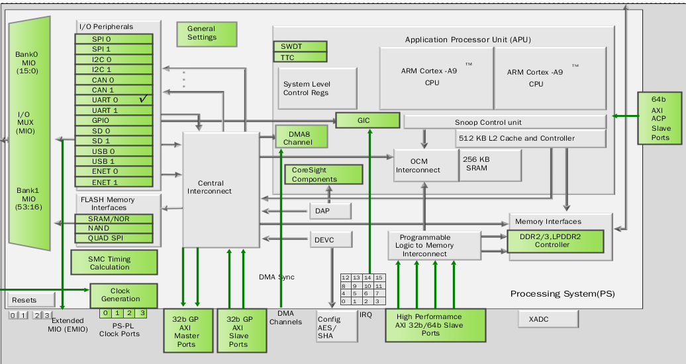
    <br>
    <div style="color:orange; border-bottom: 1px solid #d9d9d9;
    display: inline-block;
    color: #999;
    padding: 2px;">
      图2.1 zynq架构图
  	</div>
</center>

## 2.3 开发环境搭建
  ZYNQ7020是Xilinx的芯片，因此需要在对应的软件开发平台Vivado上进行开发，接下来将从硬件电路和软件程序两个方面进行开发环境的搭建。
### 2.3.1 硬件电路环境搭建
#### 1. 创建工程 <br>
  * 打开Vivado软件，点击“Create Project”
  <center>
    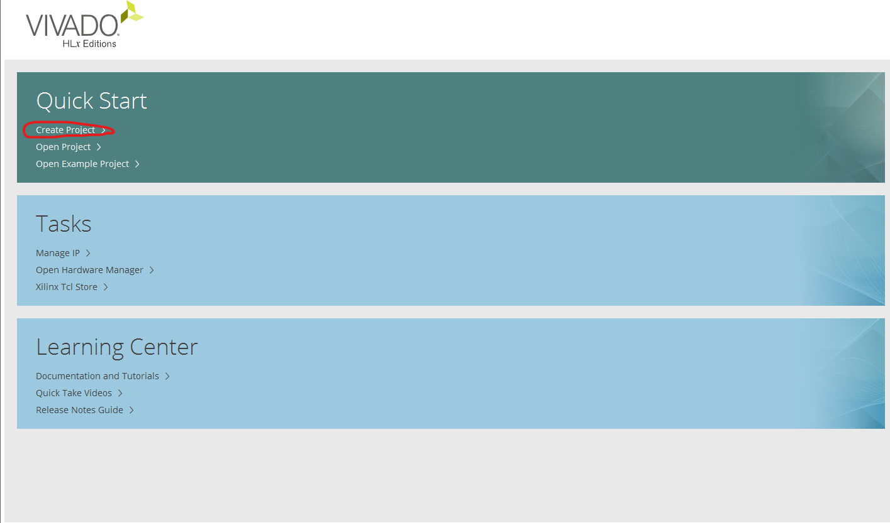
    <br>
    <div style="color:orange; border-bottom: 1px solid #d9d9d9;
    display: inline-block;
    color: #999;
    padding: 2px;">
      图2.2 创建工程01
  	</div>
  </center>
  * 点击“Next”
  <center>
    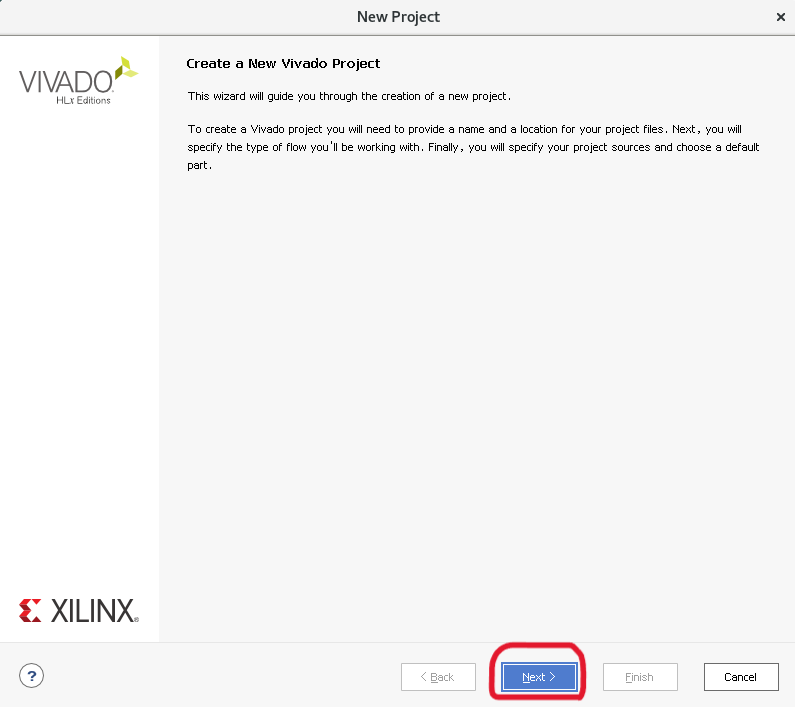
    <br>
    <div style="color:orange; border-bottom: 1px solid #d9d9d9;
    display: inline-block;
    color: #999;
    padding: 2px;">
      图2.3 创建工程02
  	</div>
  </center>
  * 在“Project name”输入项目工程的名字 <br>
  * 在“Project location”输入项目工程的路径
  <center>
    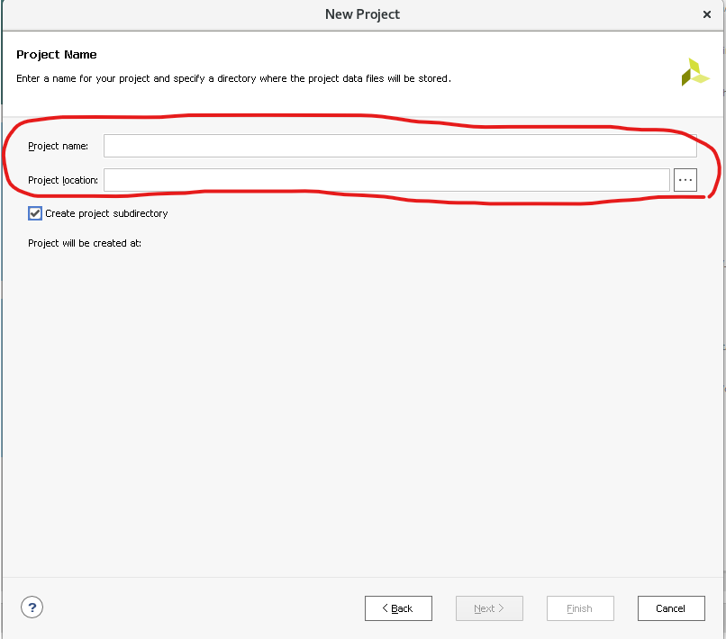
    <br>
    <div style="color:orange; border-bottom: 1px solid #d9d9d9;
    display: inline-block;
    color: #999;
    padding: 2px;">
      图2.4 创建工程03
  	</div>
  </center>
  * 选择“RTL Project”并勾选“Do not specify sources at this time”
  <center>
    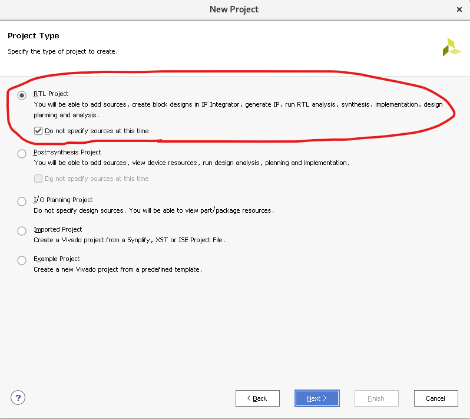
    <br>
    <div style="color:orange; border-bottom: 1px solid #d9d9d9;
    display: inline-block;
    color: #999;
    padding: 2px;">
      图2.5 创建工程04
  	</div>
  </center>
  * “Family”选择“Zynq-7000”,“Package”选择“clg484”，“Speed”选择“-2”
  * 下方选择 “xc7z020clg484-2 484 200 53200 106400 140 0 220 0”
  * 下方选择“Next”
  <center>
    
    <br>
    <div style="color:orange; border-bottom: 1px solid #d9d9d9;
    display: inline-block;
    color: #999;
    padding: 2px;">
      图2.6 创建工程05
  	</div>
  </center>
  * 红色部分进行检查
  * 最后点击“Finish”
  <center>
    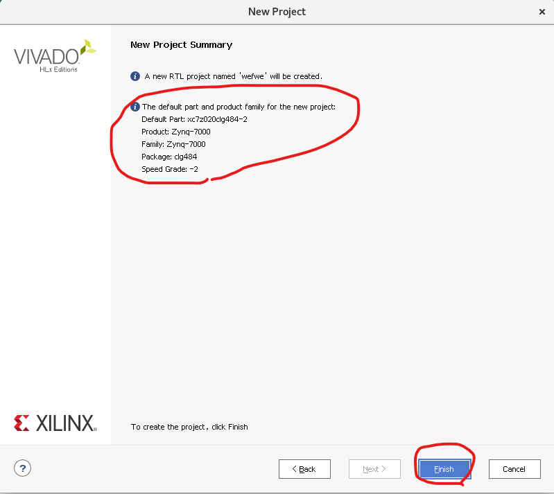
    <br>
    <div style="color:orange; border-bottom: 1px solid #d9d9d9;
    display: inline-block;
    color: #999;
    padding: 2px;">
      图2.7 创建工程06
  	</div>
  </center>
#### 2. 搭建硬件电路
      * 点击“Create Block Design”以创建电路设计
  <center>
    
    <br>
    <div style="color:orange; border-bottom: 1px solid #d9d9d9;
    display: inline-block;
    color: #999;
    padding: 2px;">
      图2.8 创建硬件电路01
  	</div>
  </center>
    * 点击“+”号以添加ZYNQ7020的PS端
    <center>
    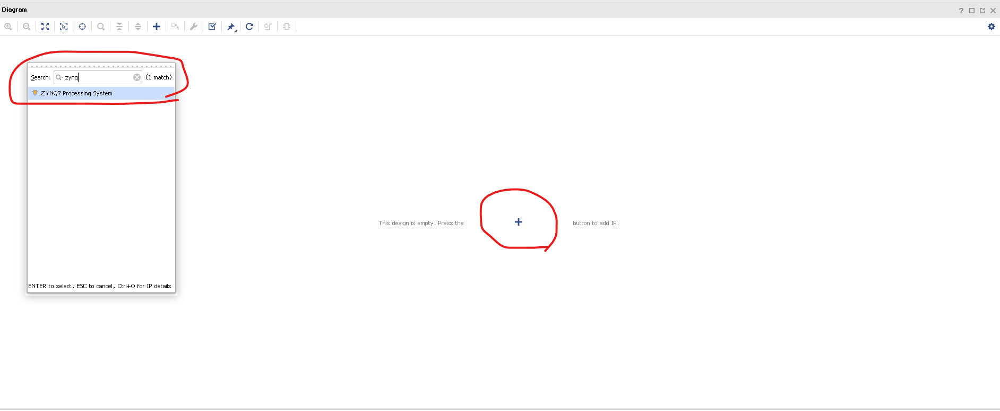
    <br>
    <div style="color:orange; border-bottom: 1px solid #d9d9d9;
    display: inline-block;
    color: #999;
    padding: 2px;">
      图2.9 创建硬件电路02
  	</div>
  </center>
    * 点击“ZYNQ7 Processing System”对ZYNQ进行配置
    <center>
    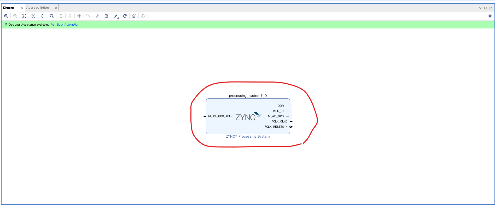
    <br>
    <div style="color:orange; border-bottom: 1px solid #d9d9d9;
    display: inline-block;
    color: #999;
    padding: 2px;">
      图2.10 创建硬件电路03
  	</div>
  </center>

  * 点击“PS-PL Configuration”对PS和PL接口进行配置
  * 在“Enable Clcok Resets”下取消“FCLK_RESET0_N”的勾选
  * 在“GP Master AXI Interface”下取消“M_AXI_GP0_interface”的勾选
    <center>
    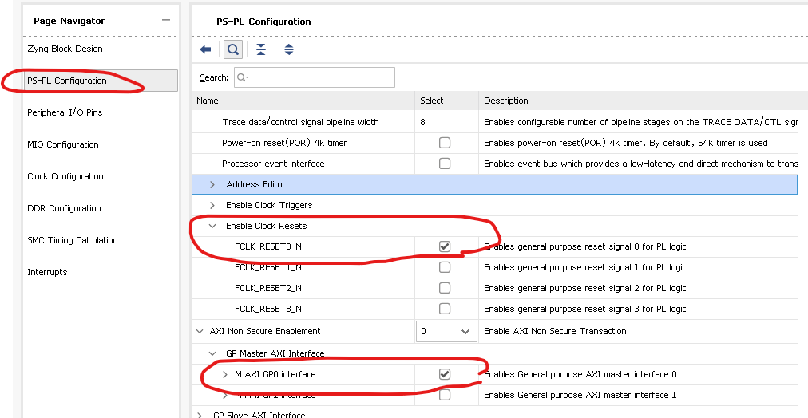
    <br>
    <div style="color:orange; border-bottom: 1px solid #d9d9d9;
    display: inline-block;
    color: #999;
    padding: 2px;">
      图2.11 处理PL-PS接口
    	</div>
    </center>
    </center>
  * 点击“Clock Configuration”对PS端的时钟进行配置
  * 在“PL Fabric Clocks”下取消“FCLK_CLK0”的勾选
    <center>
    
    <br>
    <div style="color:orange; border-bottom: 1px solid #d9d9d9;
    display: inline-block;
    color: #999;
    padding: 2px;">
      图2.12 配置PS时钟
    	</div>
    </center>
  * 点击“DDR Configuration”对DDR进行配置
  * 根据板子的具体情况选择DDR3的型号，本板子选择“MT41K256M16 RE-15E”
    <center>
    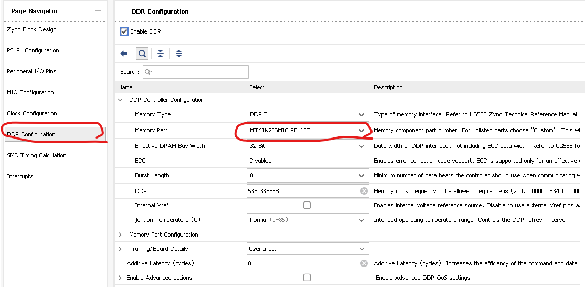
    <br>
    <div style="color:orange; border-bottom: 1px solid #d9d9d9;
    display: inline-block;
    color: #999;
    padding: 2px;">
      图2.13 配置DDR型号
    	</div>
    </center>
  * 对ZYNQ按下“Ctrl+T”进行固定管脚扩展，最后得到如图2.14的结构。
    <center>
    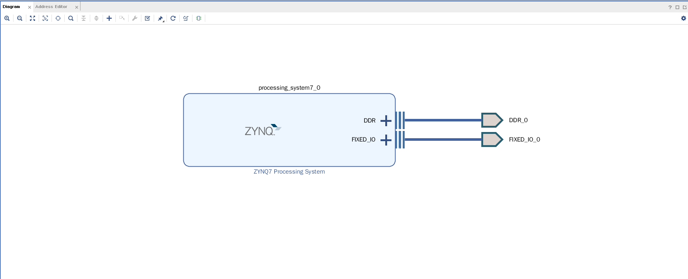
    <br>
    <div style="color:orange; border-bottom: 1px solid #d9d9d9;
    display: inline-block;
    color: #999;
    padding: 2px;">
      图2.14 完成ZYNQ电路设计
    	</div>
    </center>
  * 然后按下“F6”进行验证，
    <center>
    
    <br>
    <div style="color:orange; border-bottom: 1px solid #d9d9d9;
    display: inline-block;
    color: #999;
    padding: 2px;">
      图2.15 验证成功
    	</div>
    </center>
  * 依次点击“Generate Output Products”和“Create HDL Wrapper”以生成HDL文件
    <center>
    
    <br>
    <div style="color:orange; border-bottom: 1px solid #d9d9d9;
    display: inline-block;
    color: #999;
    padding: 2px;">
      图2.16 生成HDL文件
    	</div>
    </center>
  * 点击“Generate”以生成bit流文件
    <center>
    
    <br>
    <div style="color:orange; border-bottom: 1px solid #d9d9d9;
    display: inline-block;
    color: #999;
    padding: 2px;">
      图2.17 生成bit流
    	</div>
    </center>

#### 3. 创建软件程序
  * 依次点击“File”的“Export”的“Export Hardware”，并勾选上“Include Bitstream”，将搭建的电路系统导出到软件开发环境,点击“Launch SDK”开启软件开发环境Vivado SDK，即Eclipse魔改版。
    <center>
    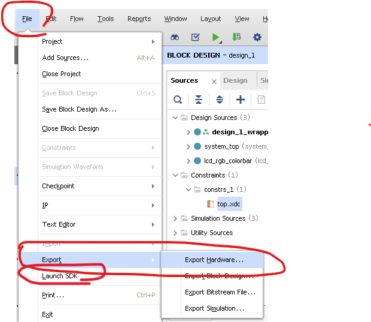
    <br>
    <div style="color:orange; border-bottom: 1px solid #d9d9d9;
    display: inline-block;
    color: #999;
    padding: 2px;">
      图2.18 导出电路系统
    	</div>
    </center>
  * 在SDK的导航页面可以看到导出硬件电路系统的硬件描述信息文件，即system.hdf文件。该文件是站在处理器角度上，看各个外设的地址分配情况即地址映射。
    <center>
    
    <br>
    <div style="color:orange; border-bottom: 1px solid #d9d9d9;
    display: inline-block;
    color: #999;
    padding: 2px;">
      图2.19 硬件描述信息
    	</div>
    </center>
  * 接下来就可以按照单片机的开发流程进行软件程序开发，本节在此不再赘述。

## 3. PS软件程序测试
### 3.1 前言
  本节将编写软件程序对PS侧的部分外设进行测试，源工程项目是由开发板作者数字积木提供，大家亦可按照第2节的介绍以及网上的相关资料自行搭建工程。
### 3.2 软件代码详解
软件main()主函数如下所示，主要可以分为灯、DDR、EEPROM和温度传感器四部分。<br>
```C
int main()
{

  int status = 0;
  int led_cnt = 0;

  xil_printf("------ start run  peripheral test ------- \n\r");

  for(int i = 0 ; i<10 ; i++ ){
    XGpio_WriteReg(AXI_GPIO_LED_BASEADDR ,  0 , led_cnt  );
    XGpio_WriteReg(AXI_GPIO_LEDRGB_BASEADDR ,  0 , led_cnt  );
    XGpio_WriteReg(AXI_GPIO_LEDRGB_BASEADDR ,  8 , led_cnt  );

    printf("%2d  Hello \n\r" ,  i );
    usleep(500*1000);
    led_cnt++  ;
  }
  printf("\n\n\r");

  XGpio_WriteReg(AXI_GPIO_LED_BASEADDR ,  0 , 0  );
  XGpio_WriteReg(AXI_GPIO_LEDRGB_BASEADDR ,  0 , 0  );
  XGpio_WriteReg(AXI_GPIO_LEDRGB_BASEADDR ,  8 , 0  );

  print("--Starting Memory Test Application--\n\r");
  print("NOTE: This application runs with D-Cache disabled.");
  print("As a result, cacheline requests will not be generated\n\r");

//    for (int i = 0; i < n_memory_ranges; i++) {
//        test_memory_range(&memory_ranges[i]);
//    }
  *(uint32_t *)(0x30000000) = 23416;
  volatile temSp = *(uint32_t *)(0x30000000);

  print("--Memory Test Application Complete--\n\r");
  print("Successfully ran Memory Test Application\n\n\r");

  xil_printf("----run eeprom test   ---- \n\r");
  status = test_eeprom();
  if( status == 0 ){
    xil_printf("Successfully run eeprom test \n\r");
  } else {
    xil_printf("eeprom test failed \n\r");
    return -1 ;
  }


  xil_printf("\n\r");
  xil_printf("----run temp sensor test  ---- \n\r");
  status = test_temp_sensor() ;
  if( status == 0 ){
    xil_printf("Successfully run temp sensor test \n\r");
  } else {
    xil_printf("temp sensor test failed \n\r");
    return -1 ;
  }

  xil_printf("\n\r");

  xil_printf("------- Successfully run  peripheral test -------  \n\r");

  while(1) {

    XGpio_WriteReg(AXI_GPIO_LED_BASEADDR ,  0 , led_cnt  );
    XGpio_WriteReg(AXI_GPIO_LEDRGB_BASEADDR ,  0 , led_cnt  );
    XGpio_WriteReg(AXI_GPIO_LEDRGB_BASEADDR ,  8 , led_cnt  );

    usleep(500*1000);
    led_cnt++  ;
  }

  xil_printf("bey !\n\n\r");

  cleanup_platform();
  return 0;
}
```
### 3.3 运行效果展示
在“SDK Terminal”绑定串口后，相关的测试信息就会被串口打印出，结果如下所示。
```C
------ start run  peripheral test ------- 

 0  Hello 
 1  Hello 
 2  Hello 
 3  Hello 
 4  Hello 
 5  Hello 
 6  Hello 
 7  Hello 
 8  Hello 
 9  Hello 


--Starting Memory Test Application--

NOTE: This application runs with D-Cache disabled.As a result, cacheline requests will not be generated

--Memory Test Application Complete--

Successfully ran Memory Test Application


----run eeprom test   ---- 
test eeprom tries  is : 1 
test eeprom length is : 1024 
................................
Successfully run eeprom test 
    

----run temp sensor test  ---- 
temp : 40 
temp : 40 
temp : 40 
temp : 40 
temp : 40 
temp : 40 
temp : 40 
temp : 40 
temp : 40 
temp : 40 


Successfully run temp sensor test 


------- Successfully run  peripheral test -------  


```
此外RGB灯光会不停的闪烁
<center>
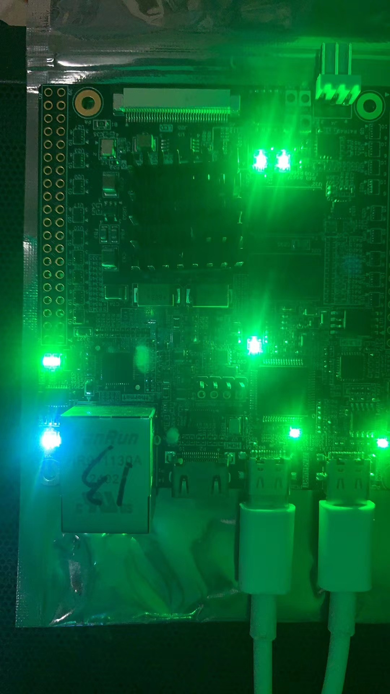
<br>
<div style="color:orange; border-bottom: 1px solid #d9d9d9;
display: inline-block;
color: #999;
padding: 2px;">
  图3.1 RGB灯闪烁
</div>
</center>


## 4. PS-PL联合测试
### 4.1 前言
  本节将在PL端编写Verilog代码以实现DMA读写DDR的功能。具体来说，PS端通过AXI-GP接口使用AXI-Lite协议对DMA内部相应的寄存器进行配置并启动DMA，然后DMA通过AXI-HP接口使用AXI-Full协议对DDR进行数据读写操作，从而完成实现软硬件协同处理。
### 4.2 搭建硬件电路
基于Block Design设计的硬件电路如图4.1所示。其中AXI_FULL和axi_lite_slave是编写的DMA IP模块，AXI SmartConnect和AXI Interconnect是仲裁器。
<center>

<br>
<div style="color:orange; border-bottom: 1px solid #d9d9d9;
display: inline-block;
color: #999;
padding: 2px;">
  图4.1 DMA电路
</div>
</center>
DMA模块的地址分配如图4.2所示,寄存器寻址基地址为0x43C0FFFF，空间大小为64K。
<center>

<br>
<div style="color:orange; border-bottom: 1px solid #d9d9d9;
display: inline-block;
color: #999;
padding: 2px;">
  图4.2 DMA地址分配
</div>
</center>

### 4.3 编写软件程序
软件main()主函数如下所示。<br>
* 首先要初始化平台
* 然后要关闭Cache，注意不关闭的话，在本次测试中会观测到错误的现象
* 然后申请一个数组
* 将这个数组的首地址配置到DMA相应的寄存器中去
* 将需要搬运数据的长度写入相应寄存器中
* 启动DMA搬运，本次测试是硬件电路端在固定写步长为2的数据
* 等待DMA操作完成
  
```C
#include <stdio.h>
#include "platform.h"
#include "xil_cache.h"
#include "xil_printf.h"
#include "xil_io.h"
#include "sleep.h"

#define BASE_ADDR XPAR_AXI_LITE_SLAVE_0_BASEADDR

int main()
{
    init_platform();
    Xil_DCacheDisable();
    Xil_ICacheDisable();
    int A[256];

    Xil_Out32(BASE_ADDR+4, A);

    Xil_Out32(BASE_ADDR+12, 255);

    Xil_Out32(BASE_ADDR, 1);

    sleep(3);


    return 0;
}

```

### 4.4 测试结果
在SDK中添加观测表达式A。在配置前，观测到A的值均是随机数。

<center>

<br>
<div style="color:orange; border-bottom: 1px solid #d9d9d9;
display: inline-block;
color: #999;
padding: 2px;">
  图4.2 DMA地址分配
</div>
</center>

在执行完DMA写操作后，观测到A的值是步长为2的数据，软硬件协同处理逻辑正确。

<center>

<br>
<div style="color:orange; border-bottom: 1px solid #d9d9d9;
display: inline-block;
color: #999;
padding: 2px;">
  图4.2 DMA地址分配
</div>
</center>

## 5. 总结
由于本人的水平和时间有限，本次测评到此就告一段落了。总的来说，此次测评的开发板漂亮的外形给人留下了深刻的印象，当然内在也丝毫不差，是一块非常优秀的ZYNQ7020开发板。再次感谢开发板作者数字积木！