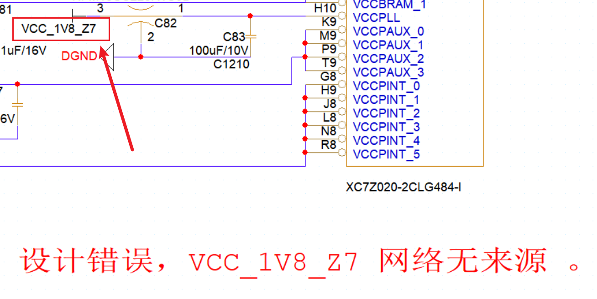
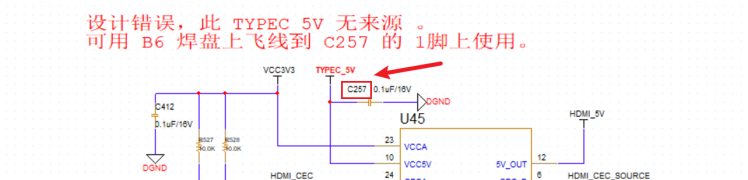
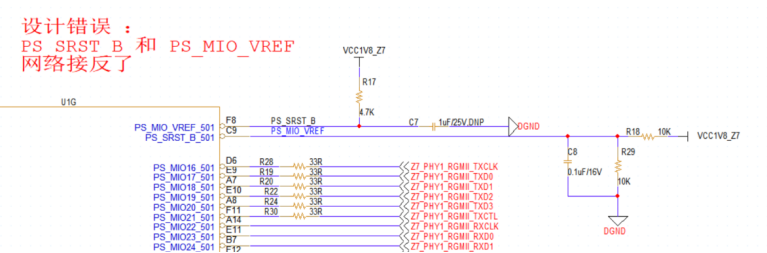

V1.0版本存在以下的设计错误，在未来的版本中将加以改正 。

1，C82  处 VCC_1V8_Z7 无来源   。

2，C257 处 TYPEC_5V 无来源   。

3，PS_SRST_B 和 PS_MIO_VREF 网络接反了 。

4，LED限流电阻值过小，LED灯亮度太刺眼 。

5，FT2232上的TX和RX接反了。（此处电路不修改，交换网络名PS_UART0_RX ，PS_UART0_TX 以及丝印名称即可，程序可兼容）。

6，OLED的IO应该连接到3.3V IO 上 。

7，PS端以太网只能跑到百兆网速，测试时需要将电脑端的网络速率强制为百兆，板卡网线直连电脑 。

